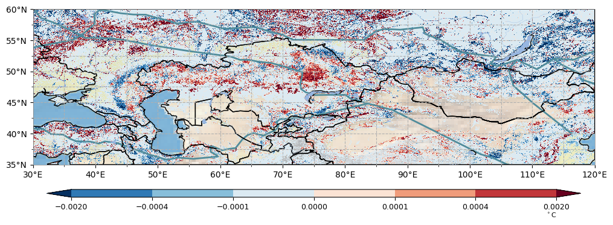
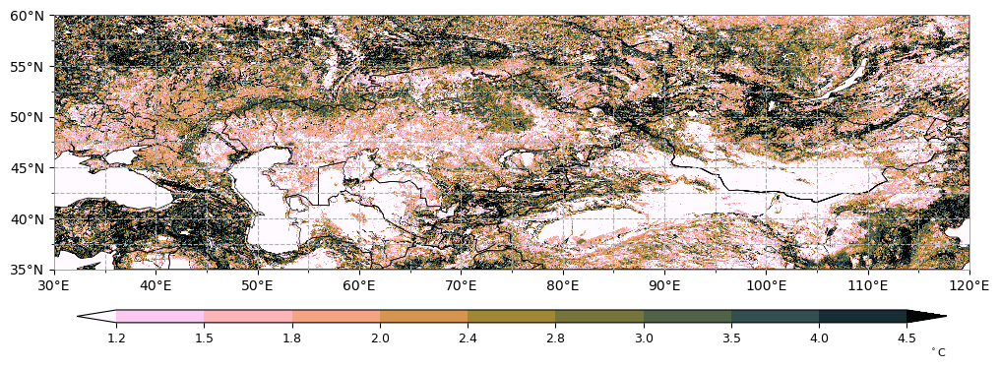
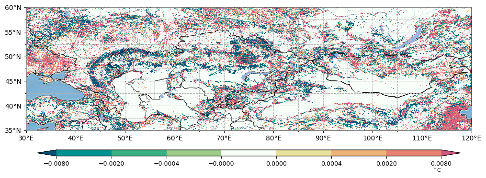
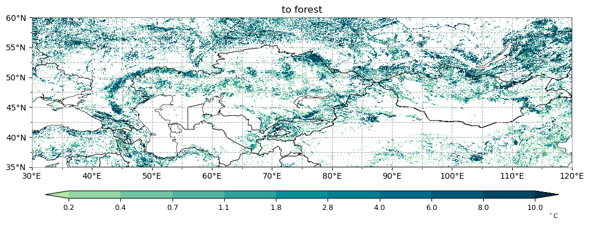

# ECEC

 code for ECEC paper


```python
import rioxarray as rxr
file_name='E:/Natural resources competition/data_result/k_tree005.tif' 
ds=rxr.open_rasterio(file_name)
data = ds[0]
data.values[data.values == 0] = None
```


```python
import numpy as np
np.nanpercentile(data, [5, 15, 30, 40, 50, 60, 70, 85, 95])
```


    array([-1.36412031e-03, -1.41323498e-04, -8.19070632e-18, -2.94965064e-18,
           -7.91794980e-19, -2.14665065e-19, -4.40386872e-20,  9.44269110e-05,
            1.34874161e-03])


```python
from utils import plot
import matplotlib.pyplot as plt
import cartopy.crs as ccrs
import numpy as np
import cartopy.feature as cfeature

fig = plt.figure(figsize=(12, 12))
proj = ccrs.PlateCarree() #ccrs.Robinson()ccrs.Mollweide()Mollweide()
ax = fig.add_subplot(111, projection=proj)
levels = np.array([-0.002, -0.0004, -0.0001, 0, 0.0001, 0.0004, 0.002])#levels = np.linspace(-1, 1, num=19)
plot.one_map_region(data, ax, cmap='RdBu_r', levels=levels,  extents=[30, 120, 35, 60], interval=[10, 5], mask_ocean=False, add_coastlines=False, add_land=False, add_gridlines=True, colorbar=True, add_stock=False, label='$^\circ$C', plotfunc="pcolormesh")
plot.add_boundary(ax, 'E:/Natural resources competition/底图/ecoLine.shp', ec="#134B70", fc="None",edgecolor='#508C9B', linewidth=2)
plot.add_boundary(ax, 'E:/Natural resources competition/底图/country.shp', ec="black", fc="None", linewidth=1)
ax.stock_img()
ax.add_feature(cfeature.OCEAN)
ax.add_feature(cfeature.RIVERS,lw=0.25)
ax.add_feature(cfeature.LAKES)

#plot.hatch_map(ax, pmaskregion, 3 * "/", label="Lack of model agreement", invert=True, linewidth=0.25, color="black")
#cmap='RdYlGn' colors=mycolor
plt.savefig('E:/Natural resources competition/figure/tree/TreeTrendMap_v2.svg', dpi=300)
#plt.clf() 
```


​    

​    


```python
import rioxarray as rxr
file_name='E:/Natural resources competition/data_result/eSHDI_27.tif' 
ds=rxr.open_rasterio(file_name)
```


```python
data = ds[0]
```


```python
import numpy as np
np.nanpercentile(data, [10, 20, 30, 40, 50, 60, 70, 80, 90])
```


    array([1.        , 1.11665918, 1.44646891, 1.78546999, 2.04247676,
           2.40012738, 2.82932239, 3.38018341, 4.26502948])


```python

```


```python
from utils import plot
import matplotlib.pyplot as plt
import cartopy.crs as ccrs
import numpy as np
fig = plt.figure(figsize=(12, 12))
proj = ccrs.PlateCarree() #ccrs.Robinson()ccrs.Mollweide()Mollweide()
ax = fig.add_subplot(111, projection=proj)
levels = np.array([1.2, 1.5, 1.8, 2, 2.4, 2.8, 3, 3.5, 4, 4.5])#levels = np.linspace(-1, 1, num=19)
plot.one_map_region(data, ax, cmap=M1, levels=levels,  extents=[30, 120, 35, 60], interval=[10, 5], mask_ocean=False, add_coastlines=False, add_land=False, add_gridlines=True, colorbar=True, add_stock=False, label='$^\circ$C', plotfunc="pcolormesh")
plot.add_boundary(ax, 'E:/Natural resources competition/底图/country.shp', ec="black", fc="None", linewidth=0.5)
#ax.set_title('Air temperature: May-Oct 2022')
#plot.hatch_map(ax, pmaskregion, 3 * "/", label="Lack of model agreement", invert=True, linewidth=0.25, color="black")
#cmap='RdYlGn' colors=mycolor
plt.savefig('E:/Natural resources competition/figure/shdi/SHDI27.svg', dpi=300)
#plt.clf() 
```


​    

​    


```python
import rioxarray as rxr
file_name='E:/Natural resources competition/data_result/k1.tif' 
ds=rxr.open_rasterio(file_name)
data = ds[0]
data.values[data.values == 0] = None
```


```python
data.values
```


    array([[            nan,             nan, -1.72014848e-04, ...,
            -5.86806664e-17, -4.38533211e-17, -4.55564990e-17],
           [            nan,             nan,             nan, ...,
            -2.73475853e-17, -9.76498095e-18, -1.32931456e-17],
           [ 4.69399828e-04,  2.06665590e-04,  1.17827745e-03, ...,
            -2.38259692e-17, -2.51371251e-17, -2.51371251e-17],
           ...,
           [            nan,             nan,             nan, ...,
                        nan,             nan,             nan],
           [            nan,             nan,             nan, ...,
                        nan,             nan,             nan],
           [            nan,             nan,             nan, ...,
                        nan,             nan,             nan]])


```python
import numpy as np
np.nanpercentile(data, [10, 20, 30, 40, 50, 60, 70, 80, 90])
```


    array([-9.79006651e-03, -7.45552409e-17, -4.07397454e-17, -2.74272715e-17,
           -1.86064393e-17, -1.21115239e-17, -1.21115239e-17,  4.75651875e-05,
            7.62004854e-03])


```python

```


```python
from matplotlib.colors import ListedColormap,LinearSegmentedColormap
MyList = ['#045275', '#009392', '#39b185', '#9ccb86', '#f8fff9','#e9e29c', '#eeb479', '#e88471', '#cf597e']

My = LinearSegmentedColormap.from_list('My',MyList)
```


```python
from utils import plot
import matplotlib.pyplot as plt
import cartopy.crs as ccrs
import numpy as np
fig = plt.figure(figsize=(12, 12))
proj = ccrs.PlateCarree() #ccrs.Robinson()ccrs.Mollweide()Mollweide()
ax = fig.add_subplot(111, projection=proj)
levels = np.array([-0.008, -0.002, -0.0004, -0.00000001, 0.00000001, 0.0004, 0.002, 0.008])#levels = np.linspace(-1, 1, num=19)
plot.one_map_region(data, ax, cmap=My, levels=levels,  extents=[30, 120, 35, 60], interval=[10, 5], mask_ocean=False, add_coastlines=False, add_land=False, add_gridlines=True, colorbar=True, add_stock=False, label='$^\circ$C', plotfunc="pcolormesh")
plot.add_boundary(ax, 'E:/Natural resources competition/底图/country.shp', ec="black", fc="None", linewidth=0.5)
ax.stock_img()
ax.add_feature(cfeature.OCEAN)
ax.add_feature(cfeature.RIVERS,lw=0.25)
ax.add_feature(cfeature.LAKES)
#plot.hatch_map(ax, pmaskregion, 3 * "/", label="Lack of model agreement", invert=True, linewidth=0.25, color="black")
#cmap='RdYlGn' colors=mycolor
plt.savefig('E:/Natural resources competition/figure/shdi/kSHDI_v2.svg', dpi=300)
#plt.clf() 
```


​    

​    


```python

```


```python
import rioxarray as rxr
file_name='E:/Natural resources competition/data_result/rollout.tif' 
ds=rxr.open_rasterio(file_name)
data = ds[0]
data.values[data.values == 0] = None
```


```python
data.values
```


    array([[nan, nan, nan, ..., nan, nan, nan],
           [nan, nan, nan, ..., nan, nan, nan],
           [nan, nan, nan, ..., nan, nan, nan],
           ...,
           [nan, nan, nan, ..., nan, nan, nan],
           [nan, nan, nan, ..., nan, nan, nan],
           [nan, nan, nan, ..., nan, nan, nan]])


```python
import numpy as np
np.nanpercentile(data, [10, 20, 30, 40, 50, 60, 70, 80, 90])
```


    array([ 0.19230769,  0.38461538,  0.67307692,  1.10576923,  1.73076923,
            2.68269231,  4.14903846,  6.55528846, 11.61057692])


```python
from utils import plot
import matplotlib.pyplot as plt
import cartopy.crs as ccrs
import numpy as np
fig = plt.figure(figsize=(12, 12))
proj = ccrs.PlateCarree() #ccrs.Robinson()ccrs.Mollweide()Mollweide()
ax = fig.add_subplot(111, projection=proj)
levels = np.array([0.2, 0.4, 0.7, 1.1, 1.8, 2.8, 4, 6, 8, 10])#levels = np.linspace(-1, 1, num=19)
plot.one_map_region(data, ax, cmap=S2, levels=levels,  extents=[30, 120, 35, 60], interval=[10, 5], mask_ocean=False, add_coastlines=False, add_land=False, add_gridlines=True, colorbar=True, add_stock=False, label='$^\circ$C', plotfunc="pcolormesh")
plot.add_boundary(ax, 'E:/Natural resources competition/底图/country.shp', ec="black", fc="None", linewidth=0.5)
ax.set_title('to forest')
#plot.hatch_map(ax, pmaskregion, 3 * "/", label="Lack of model agreement", invert=True, linewidth=0.25, color="black")
#cmap='RdYlGn' colors=mycolor
plt.savefig('E:/Natural resources competition/figure/roll/rollout.svg', dpi=300)
#plt.clf() 
```


​    

​    

